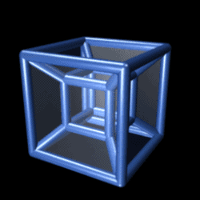

# Hi there, I'm Göktuğ Çakıroğlu 👋

  

  
  

As a Computer Engineering student, I avoid limiting myself to a single technology stack. Driven by a broad interest and deep curiosity, I explore the entire spectrum of computer science—from low-level hardware constraints up to modern high-level AI implementations, focusing on how systems work under the hood. I thrive on turning academic theories into hands-on personal experiments and practical prototypes.

---

## 🛠️ Technology Spectrum

### 🔴 Core & Systems Engineering

### 🔵 Software & Intelligence

---

## 📊 GitHub Analytics

  

---

## 🔗 Connect with me

